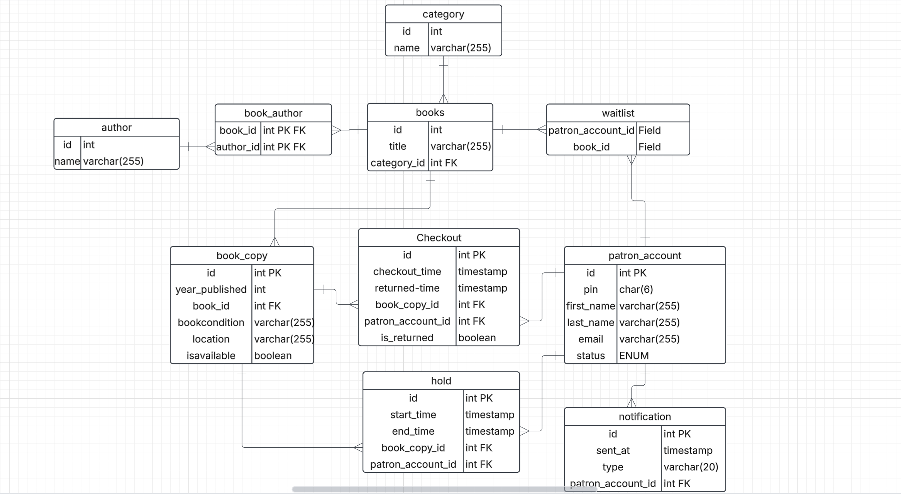

# 🔙 Library App - Backend

This is the backend REST API for the Library Management System. Built with **Node.js**, **Express.js**, and **MySQL**, it powers the core operations of the system — including managing books, patrons, checkouts, and user authentication.

## 🔧 Tech Stack

- **Node.js**
- **Express.js**
- **MySQL**

## 🧱 Architecture

This backend follows the **Model-View-Controller (MVC)** design pattern:

- **Model**: Represents the data layer using plain JavaScript classes or query modules that interact directly with the MySQL database.
- **Controller**: Handles the application logic — processing incoming requests, validating input, and coordinating with models to perform operations.
- **View**: Since this is a RESTful API, the "view" is the **JSON response** returned to the client. The actual user interface is handled separately by the **React frontend**, which consumes these API responses.

## 🚀 Live API

- [Backend on Railway](https://library-app-production-8775.up.railway.app)

## ⚙️ Setup Instructions

```bash
git clone https://github.com/yourusername/library-app-backend.git
cd library-app-backend
npm install
npm run dev
```

## ⚙️ Environment Variables

To run the application, make sure to configure the following environment variables:

```bash
MYSQLHOST=<your-mysql-host>
MYSQLUSER=<your-mysql-username>
MYSQLPASSWORD=<your-mysql-password>
MYSQL_DATABASE=<your-mysql-database-name>
JWT_SECRET=<your-jwt-secret-key>
```

## 🗂️ Database Diagram

Here is a visual representation of the database schema:



## 📡 API Endpoints

### 🔐 Auth Routes (`/api/auth`)

- **`GET /`**: Get all registered users (Admin only)
- **`POST /register`**: Register a new user (Admin only)
- **`POST /login`**: Authenticate user and return JWT
- **`PUT /updateuser/:id`**: Update user information by ID (Admin only)
- **`DELETE /delete/:id`**: Delete user by ID (Admin only)

---

### 📚 BookCopy Routes (`/api/bookcopy`)

- **`GET /copies`**: Get all book copies
- **`POST /copies`**: Add a new book copy
- **`PUT /copies/:id`**: Update book copy by ID
- **`DELETE /copies/:id`**: Delete a book copy by ID
- **`GET /copy/:id`**: Get details of a specific book copy

---

### 📖 Book Routes (`/api/book`)

- **`GET /books`**: Get all books
- **`GET /authors/search`**: Get author suggestions
- **`POST /addBook`**: Add a new book
- **`DELETE /book/:id`**: Delete a book by ID

---

### 📥 Checkout/Return Routes (`/api/checkoutreturn`)

- **`POST /checkout/:bookcopyid/:patronid`**: Checkout a book copy to a patron
- **`PUT /return/:id`**: Return a book copy by ID
- **`GET /patroninfo/:id`**: Get patron information
- **`GET /patron/:id`**: Get books checked out by a specific patron

---

### 🙋 Patron Routes (`/api/patron`)

- **`POST /addpatron`**: Add a new patron
- **`PUT /activatepatron/:id`**: Activate a patron by ID
- **`PUT /suspendpatron/:id`**: Suspend a patron by ID
- **`GET /patrons`**: Get all patrons
- **`PUT /updatePatron/:id`**: Update patron information by ID

